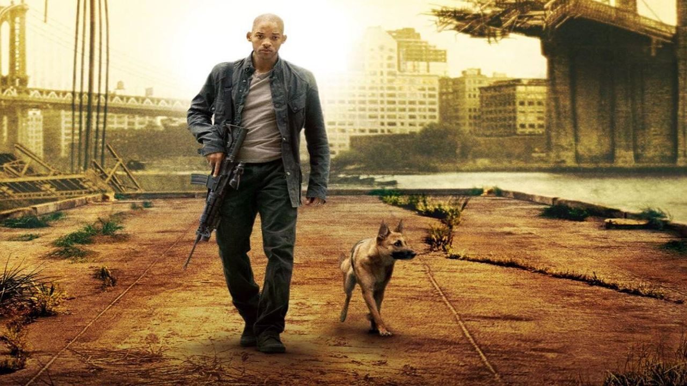

# Acción

El llamado cine de acción es un género cinematográfico donde prima la espectacularidad de las imágenes por medio de efectos especiales de estilo "clásico". La denominación es más un convencionalismo popular, que un género cinematográfico puro acuñado por críticos, estudiosos o cineastas. Los elementos más frecuentes de una película de acción son persecuciones (tanto a pie como con vehículos), tiroteos, enfrentamientos, artes marciales y luchas callejeras, armas, explosiones, agresiones y cualquier situación violenta o intensa.

## I Am Legend - Ficha técnica
- **Título**: I Am Legend
- **Duración**: 1h 41min
- **Dirigido por**: Francis Lawrence
- **IMDb**: 7.2/10
- **Año**: 2007
- **Género**: Acción
- **Reparto**: Will Smith, Alice Braga, Charlie Tahan, Salli Richardson, Willow Smith, Dash Mihok, Joanna Numata, Darrell Foster